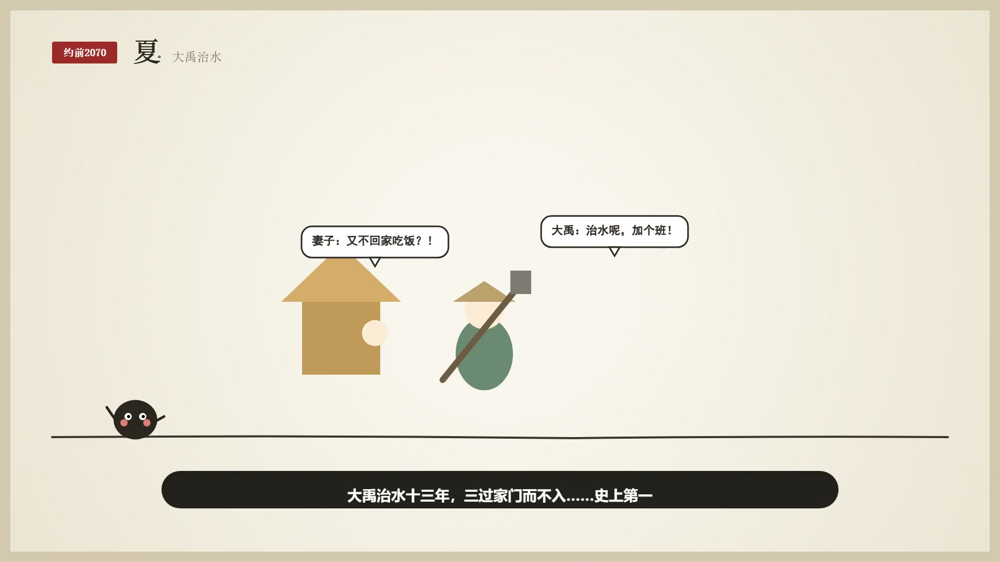
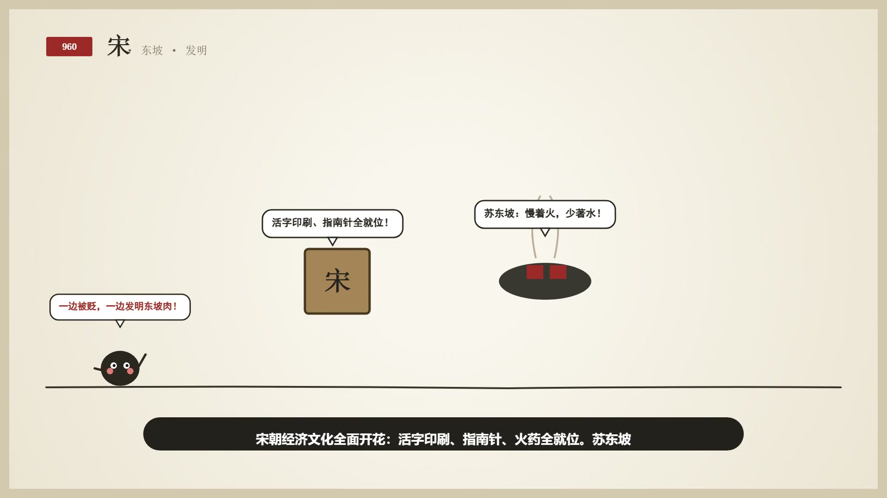
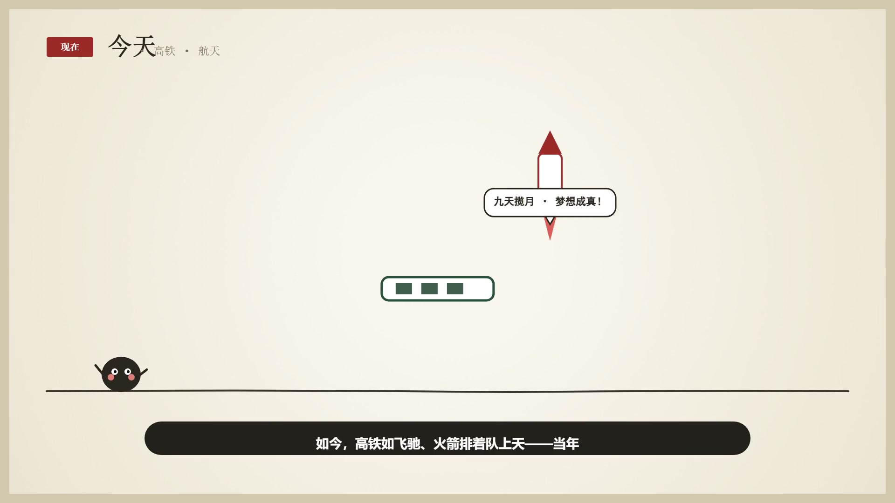

# 一支笔画完中国史 · 极简国风全动态历史科普视频引擎 🖌️🇨🇳
> **One-Pen Chinese History Explainer**: 0 模型成本 · 60fps 满帧丝滑 · 纯代码级矢量驱动的全自动短视频生成系统

<p align="center">
  
  
</p>
<p align="center">
  
  
</p>

---

## 💡 项目简介

灵感源自网络爆款科普视频《五千年：一支笔画完中国史》。原片通过一根极简线条与网络热梗将上下五千年串联，但存在**画风粗糙单调、纯静音录屏无配音、画面缺少动作生命力**等硬伤。

本项目基于 **Hypit 视频工程架构** 与 **HTML5 Canvas 60fps 动态物理渲染引擎** 对原片进行了**工业级彻底重构**：
1. **美术画风升级**：米黄熟宣纸温润底色 + 朱砂印章 + Q 版国风萌系人物造型，告别廉价黑白细线；
2. **生动连环动画**：彻底摒弃死板的“静画推镜头”，实现**元素分步登场、肢体微动作、受热颤抖、火苗跳跃、双向爆梗吐槽气泡**；
3. **视听全面合一**：字正腔圆的幽默口播旁白 + 打字机式逐字同步字幕 + 中国古典轻快五声（宫商角徵羽）丝竹 BGM；
4. **极致 0 成本**：纯前端代码与物理引擎驱动，无头 Chrome 60fps 实时录制，**完全无需付费调用视频大模型，单片生成成本永久 ¥0.00**！

---

## 🎬 核心特性

- ⚡ **60fps 满帧丝滑**: 基于原生 Canvas/RequestAnimationFrame 硬件加速渲染，动作无任何卡顿。
- 📦 **极小体积交付**: 完整版 3 分多钟 1080P 视频体积仅 **8.55 MB**，全平台免二次转码秒开秒加载。
- 💬 **双向爆梗互动**: 每个朝代均配备主角与左下角吉祥物（小墨水团子）的趣味吐槽气泡，完播率拉满。
- 🎯 **精确语义卡点**: 语音时序与画面动作毫秒级对齐，话音未落动作即达。
- 🛠️ **模块化高可扩展**: 19 篇章剧本结构化存储于 `chapters.json`，可任意增删朝代或替换文案。

---

## 📜 19 篇章全景剧本结构

| 篇章序号 | 朝代/时期 | 核心标志性意象 | 趣味爆梗解说 |
|:---:|---|---|---|
| **01** | **片头开篇** | 米黄熟宣纸展开，千里水墨横线延伸 | “五千年，一支笔，画完中国史。” |
| **02** | **上古 · 三皇五帝** | 太阳升起，炎黄二帝牵手大红心跳动 | “打了一架握手成了一家人，从此都叫炎黄子孙。” |
| **03** | **夏 · 大禹治水** | 妻子茅屋门口叉腰怒吼，大禹扛铲狂奔 | “三过家门而不入……史上第一位加班狂。喜提王位。” |
| **04** | **商 · 甲骨文** | 烈火炙烤龟壳受热剧烈微颤，裂纹生长蹦字，小乌龟流汗爬行 | “商朝人遇事不决？烤龟壳！看裂纹定吉凶。” |
| **05** | **周 · 烽火戏诸侯** | 烽火台滚滚狼烟，幽王褒姒城楼大笑 | “为博美人一笑点烽火——「聊死了」真实版，这周总算倒霉。” |
| **06** | **春秋战国 · 百家争鸣** | 孔子(仁)、老子(无为)、墨子(兼爱)、韩非(法)排队争论 | “诸侯打成一锅粥，思想家却吵出了黄金时代。” |
| **07** | **秦 · 六一统** | 始皇展臂，半两铜钱弹跳，小篆竹简展开，长城巍峨 | “文字货币车轮都要统一——强迫症的胜利。长城兵马俑安排上了。” |
| **08** | **汉 · 丝绸之路** | 绵延沙丘，张骞持节骑双峰骆驼出使，紫葡萄吃货狂喜 | “一趟出差十三年，顺手走出丝绸之路。「吃货」狂喜！” |
| **09** | **三国 · 魏蜀吴** | 诸葛亮羽扇微摇，草船插满十万支飞箭，曹操喊撤退 | “三分天下。诸葛亮草船借箭借了十万支——一支都没还。” |
| **10** | **魏晋南北朝 · 兰亭** | 巨幅行书“之”字大轴，王羲之挥毫配大白鹅引吭高歌 | “天下很乱文人很飘。王羲之爱写字爱养鹅，《兰亭序》火了一千年。” |
| **11** | **隋 · 大运河** | 宽阔运河帆船穿梭，贡院考棚科举开榜金榜题名 | “只存在38年干了两件大事：挖通大运河，开创科举读书改命。” |
| **12** | **唐 · 盛世大唐** | 巍峨长安大雁塔，皎洁明月，诗仙李白举金樽醉步 | “万国来朝。李白喝醉看明月——诗写得好，酒量更有长进。” |
| **13** | **宋 · 科技美食** | 活字印刷字模阵列旋转，苏东坡守着大铁锅慢火炖肉 | “三大发明全就位。苏东坡更忙，一边被贬一边发明东坡肉。” |
| **14** | **元 · 蒙古铁骑** | 辽阔大元疆域版图，马可·波罗背着行囊奋笔疾书游记 | “铁骑狂奔版图大到装不下，马可波罗写了本畅销日记。” |
| **15** | **明 · 郑和下西洋** | 浩瀚波涛汹涌，九桅十二帆巍峨郑和宝船破浪远航 | “郑和七下西洋，宝船比八十年后哥伦布的旗舰大得多。” |
| **16** | **清 · 盛世到近代** | 顶戴官员高呼“人口破3亿！”，近代黑色战舰冒滚滚黑烟 | “康乾盛世人口破三亿……可惜1840年列强战舰开到家门口。” |
| **17** | **辛亥 · 帝制落幕** | 青年手执巨大红色剪刀咔嚓剪断长辫，皇帝宝座倾覆 | “辛亥革命剪掉辫子，两千多年的皇帝制度正式画上句号！” |
| **18** | **新中国 · 开国大典** | 大红灯笼摇曳，五彩礼花绽放，“1949”金色大字闪耀 | “1949年中华人民共和国成立。一步一个脚印，日子越过越红火。” |
| **19** | **今天 · 伟大复兴** | 现代复兴号高铁飞驰，运载火箭喷吐烈焰直刺苍穹 | “高铁飞驰火箭排队上天——当年的九天揽月，如今已变成了现实！” |

---

## 🚀 快速开始

### 1. 环境准备
- Node.js (>= 18.0)
- Python 3.10+ (包含 `win32com` / `SAPI` 或 Edge-TTS)
- FFmpeg (已配置到系统环境变量 PATH)
- Google Chrome 浏览器 (用于无头硬件级 60fps 录屏)

### 2. 本地安装
```bash
git clone https://github.com/kany2000/one-pen-history.git
cd one-pen-history
npm install puppeteer-core
```

### 3. 一键体验与生成

- **实时在浏览器中交互预览动画**：
  ```bash
  npm run preview
  ```
- **重新合成 19 篇章独立语音**：
  ```bash
  npm run build:voices
  ```
- **无头 Chrome 60fps 实时录制并一键导出成片**：
  ```bash
  npm run record
  ```
  执行完毕后将在根目录自动输出 `full_dynamic_cartoon_history.mp4`！

---

## 📂 目录结构

```text
one-pen-history/
├── full_motion_engine.html       # 核心：19篇章Canvas逐帧物理与动画引擎
├── record_full_dynamic.js        # 自动化：无头Chrome 60fps录屏与FFmpeg合成调度
├── chapters.json                 # 剧本：19个朝代的结构化台词与印章元数据
├── full_timeline.json            # 时序：包含每个篇章起止毫秒的时间戳索引
├── generate_full_voices.py       # 语音：自动化旁白配音生成管道
├── ANALYSIS.md                   # 文档：原片视听心理学与六大系统深度解剖
├── TIMELINE.md                   # 文档：分秒分镜时序对齐表
├── reference.svml & .svs         # Hypit：标准作者源码与样式配方
├── chapters_svg/                 # 资产：全套19朝代定制矢量源码
├── chapters_png/                 # 资产：1080P光栅化图层
└── full_dynamic_cartoon_history.mp4 # 最终成片示范 (1080P 60fps)
```

---

## 📄 开源协议

本项目基于 [MIT License](LICENSE) 开源协议。
欢迎 Star ⭐️ 与二次创作！
